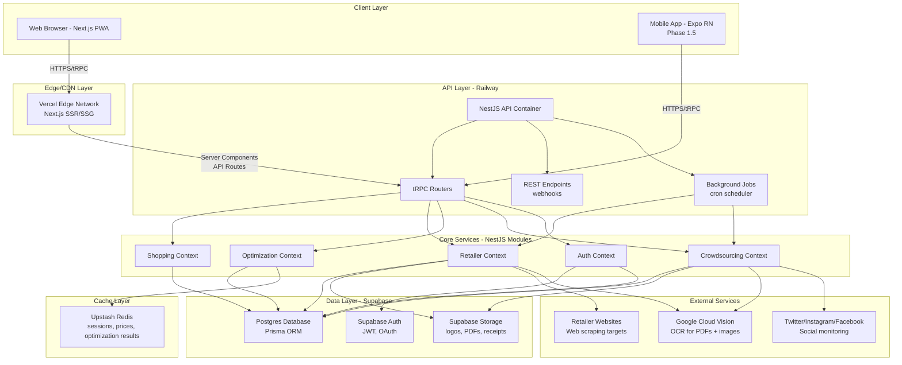

# 2. High-Level Architecture

## 2.1 Technical Summary

TillLess implements a **modular monolith architecture** with Domain-Driven Design (DDD) bounded contexts deployed as a unified NestJS application. The frontend uses **Next.js 15 with App Router** for both SSR and static generation, communicating via **tRPC** for end-to-end type safety. The system follows a **Jamstack-inspired pattern** with server-side optimization calculations and client-side interactive UI.

**Key Architectural Decisions:**

- **Deployment Model:** Next.js PWA on Vercel (edge-optimized), NestJS API on Railway (single container), Supabase Postgres (managed), Upstash Redis (serverless)
- **Frontend Stack:** Next.js 15 App Router, React 18 Server Components, Tailwind CSS v4 with OKLCH colors, Shadcn UI components, TanStack Query for server state
- **Backend Stack:** NestJS with 5 bounded contexts (Shopping, Retailer, Optimization, Crowdsourcing, Auth), Prisma ORM, tRPC routers, Strategy pattern for data acquisition
- **Integration Approach:** tRPC provides type-safe RPC layer, shared TypeScript types in monorepo packages, domain events via NestJS EventEmitter for inter-context communication
- **Infrastructure Platform:** Multi-cloud approach leveraging free tiers (Vercel, Railway, Supabase, Upstash, GCP Vision API)

**How This Achieves PRD Goals:**
- **8%+ savings:** Optimization engine with category-level assignment, loyalty pricing integration, travel cost modeling
- **≤10 min decision time:** Category-first UI with progressive disclosure, threshold nudges only when savings ≥R30
- **85%+ categorization accuracy:** Auto-categorization with keyword matching (Phase 1), ML embeddings (Phase 1.5)
- **Category budget visibility:** Real-time budget tracking per category with visual indicators (Green/Yellow/Red)
- **500 active users in 3 months:** Scalable architecture within free tier limits, horizontal scaling ready for Railway API

## 2.2 Platform and Infrastructure Choice

**Platform:** Multi-cloud (Vercel, Railway, Supabase, Upstash, GCP)

**Key Services:**
- **Compute:** Vercel Edge Functions (Next.js), Railway Container (NestJS)
- **Database:** Supabase Postgres (managed, EU region)
- **Cache:** Upstash Redis (serverless, global replication)
- **Storage:** Supabase Storage (2GB, images, PDFs, receipts)
- **Auth:** Supabase Auth (JWT, magic links, OAuth)
- **OCR:** Google Cloud Vision API (pay-as-you-go)
- **Monitoring:** Sentry (errors), PostHog (analytics), BetterUptime (health checks)

**Deployment Host and Regions:**
- **Vercel:** Global edge network, primary deployment in EU/US (auto-optimized)
- **Railway:** US-West (Oregon) or EU-West (Ireland) for POPIA compliance
- **Supabase:** EU-West (Ireland) - GDPR/POPIA compliant
- **Upstash:** Global replication with South African edge nodes

**Rationale:** Meets R150/month budget, provides excellent DX for rapid MVP development, scales to 500+ users within free tiers, and all services support POPIA-compliant data residency.

## 2.3 Repository Structure

**Structure:** Nx Monorepo with apps/packages separation

**Monorepo Tool:** Nrwl Nx

**Package Organization:**

```
tillless/
├── apps/
│   ├── web/                    # Next.js 15 PWA (primary user interface)
│   ├── api/                    # NestJS backend (tRPC + REST)
│   ├── admin/                  # Admin dashboard
│   └── backend/                # Additional backend services
├── libs/
│   ├── database/               # Prisma schema, migrations, seed data
│   ├── scrapers/               # Data acquisition strategies
│   ├── ocr/                    # OCR processing utilities
│   └── shared/                 # Shared types, utils, constants
├── nx.json                     # Nx workspace config
├── package.json                # Root dependencies
├── pnpm-workspace.yaml         # pnpm workspace configuration
└── tsconfig.base.json          # Base TypeScript config with path aliases
```

## 2.4 High-Level Architecture Diagram



## 2.5 Architectural Patterns

**Overall Architecture Patterns:**

- **Modular Monolith with DDD Bounded Contexts** - NestJS modules represent bounded contexts (Shopping, Retailer, Optimization, Crowdsourcing, Auth) with clear boundaries, enabling future microservices extraction if needed. _Rationale: Balances MVP speed (single deployment) with long-term scalability (clear module boundaries)._

- **Jamstack-Inspired** - Next.js generates static pages where possible (marketing, help), server-renders dynamic content (dashboard, optimization results), and delegates complex calculations to API. _Rationale: Optimal performance (CDN-served static content) while maintaining dynamic features._

- **API Gateway Pattern** - tRPC routers act as unified entry point for all client requests, with middleware for auth, rate limiting, and logging. _Rationale: Centralized cross-cutting concerns, type-safe client-server communication._

**Frontend Patterns:**

- **Component-Based UI (React)** - Shadcn UI components (copy-paste approach) with Tailwind CSS v4 styling, full TypeScript types. _Rationale: Maintainability through reusable components, no runtime CSS-in-JS overhead, easy customization._

- **Server Components First** - Default to React Server Components for data fetching, use Client Components only for interactivity. _Rationale: Reduced client bundle size, faster initial page loads, better SEO._

- **Optimistic UI Updates** - TanStack Query optimistic updates for shopping list edits (instant feedback), background sync on success. _Rationale: Perceived performance improvement, better UX for high-frequency actions._

**Backend Patterns:**

- **Repository Pattern** - Abstract data access behind interfaces (`IShoppingListRepository`, `IPriceRepository`), Prisma implementation. _Rationale: Enables testing with in-memory repos, future database migration flexibility._

- **Strategy Pattern (Data Acquisition)** - `IDataAcquisitionStrategy` interface with concrete strategies: `WebScraperStrategy`, `PDFOCRStrategy`, `ManualEntryStrategy`, `CrowdsourcedStrategy`. _Rationale: Pluggable data sources without modifying core logic, easy to add new retailers._

- **Domain Events** - Use NestJS EventEmitter for inter-context communication: `PriceUpdatedEvent` (Retailer → Optimization), `ItemCategorizedEvent` (Shopping → Optimization). _Rationale: Decoupled bounded contexts, maintains DDD principles._

---
