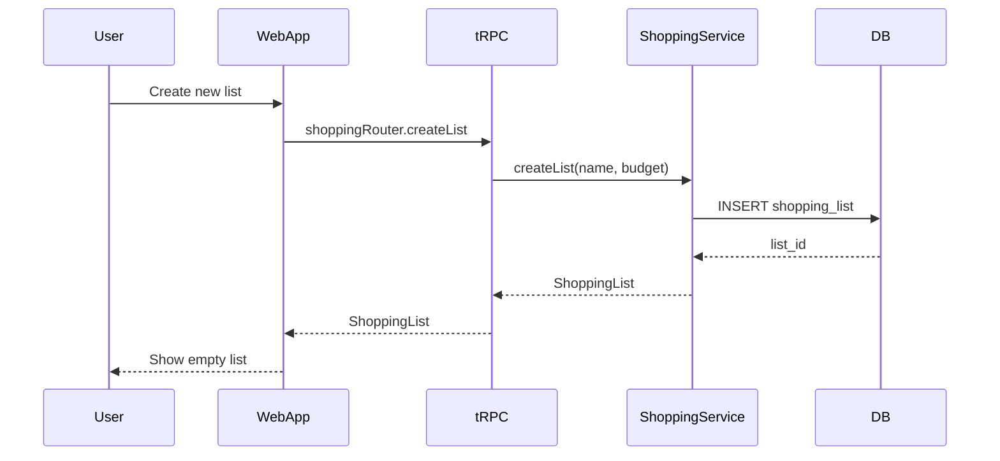
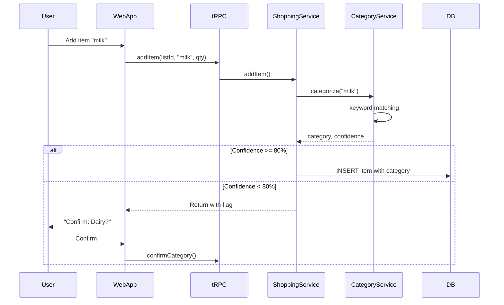
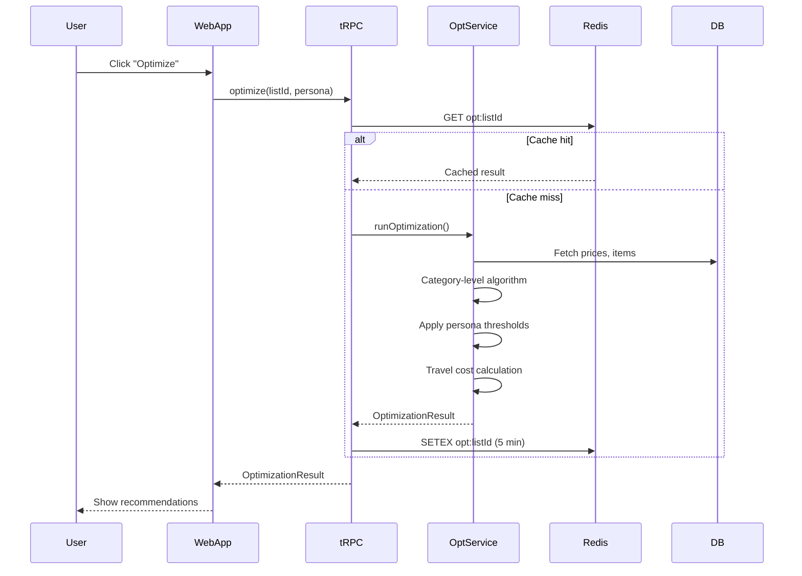

# 8. Core Workflows

## 8.1 Shopping List Creation Flow

```mermaid
sequenceDiagram
    participant User
    participant WebApp
    participant tRPC
    participant ShoppingService
    participant DB
    
    User->>WebApp: Create new list
    WebApp->>tRPC: shoppingRouter.createList
    tRPC->>ShoppingService: createList(name, budget)
    ShoppingService->>DB: INSERT shopping_list
    DB-->>ShoppingService: list_id
    ShoppingService-->>tRPC: ShoppingList
    tRPC-->>WebApp: ShoppingList
    WebApp-->>User: Show empty list
```

## 8.2 Item Addition & Auto-Categorization Flow

```mermaid
sequenceDiagram
    participant User
    participant WebApp
    participant tRPC
    participant ShoppingService
    participant CategoryService
    participant DB
    
    User->>WebApp: Add item "milk"
    WebApp->>tRPC: addItem(listId, "milk", qty)
    tRPC->>ShoppingService: addItem()
    ShoppingService->>CategoryService: categorize("milk")
    CategoryService->>CategoryService: keyword matching
    CategoryService-->>ShoppingService: category, confidence
    alt Confidence >= 80%
        ShoppingService->>DB: INSERT item with category
    else Confidence < 80%
        ShoppingService-->>WebApp: Return with flag
        WebApp-->>User: "Confirm: Dairy?"
        User->>WebApp: Confirm
        WebApp->>tRPC: confirmCategory()
    end
```

## 8.3 Optimization Engine Flow

```mermaid
sequenceDiagram
    participant User
    participant WebApp
    participant tRPC
    participant OptService
    participant Redis
    participant DB
    
    User->>WebApp: Click "Optimize"
    WebApp->>tRPC: optimize(listId, persona)
    tRPC->>Redis: GET opt:listId
    alt Cache hit
        Redis-->>tRPC: Cached result
    else Cache miss
        tRPC->>OptService: runOptimization()
        OptService->>DB: Fetch prices, items
        OptService->>OptService: Category-level algorithm
        OptService->>OptService: Apply persona thresholds
        OptService->>OptService: Travel cost calculation
        OptService-->>tRPC: OptimizationResult
        tRPC->>Redis: SETEX opt:listId (5 min)
    end
    tRPC-->>WebApp: OptimizationResult
    WebApp-->>User: Show recommendations
```
