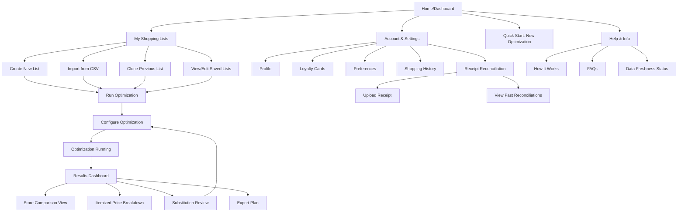
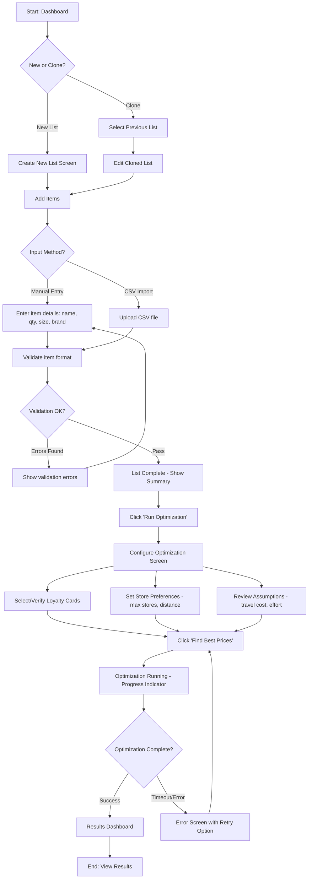
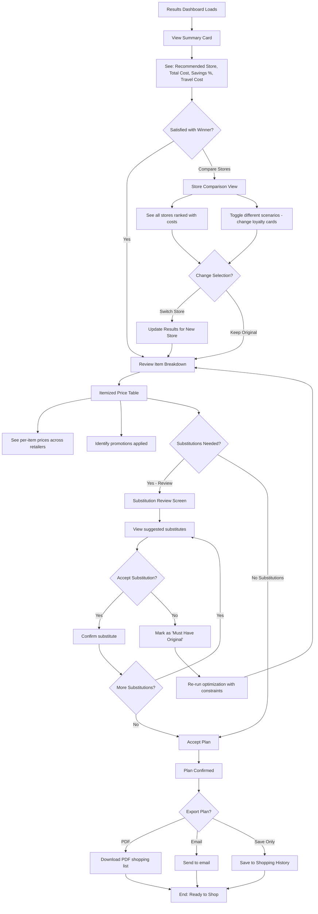
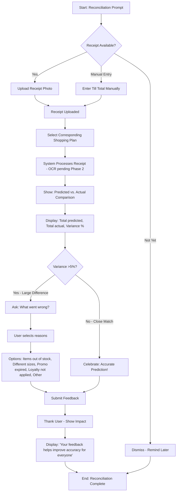
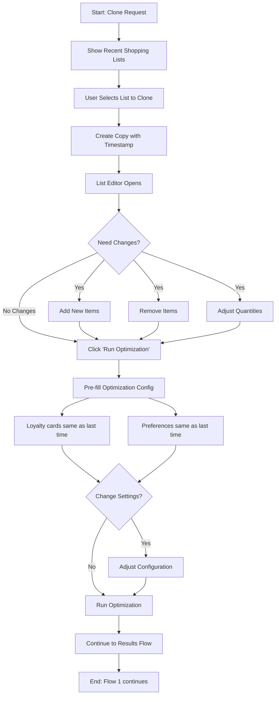

# TillLess UI/UX Specification

## Introduction

This document defines the user experience goals, information architecture, user flows, and visual design specifications for TillLess's user interface. It serves as the foundation for visual design and frontend development, ensuring a cohesive and user-centered experience.

### Change Log

| Date | Version | Description | Author |
|------|---------|-------------|--------|
| 2025-10-19 | 1.0 | Initial UI/UX specification created | Sally (UX Expert) |

## Overall UX Goals & Principles

### Target User Personas

**Primary: Thandi (Budget-Conscious Parent)**
- Family shopper in Gauteng doing large monthly grocery runs for household of four
- Tech-comfortable, holds multiple loyalty cards (Xtra Savings, Smart Shopper, WRewards, mCard)
- Values budget optimization but wants to minimize multi-store hassle
- Key need: Maximize savings while minimizing effort and complexity

**Secondary: Bongani (Bulk Buyer / Side Hustler)**
- Purchases household staples plus bulk items for resale, Makro-focused
- Highly sensitive to promotion timing and unit economics (carton sizes, bulk pricing)
- Needs clear visibility into delivery vs. pickup logistics
- Key need: Warehouse-level purchasing power with granular cost breakdowns

**Future (Phase 2): Sipho (Health-Conscious Professional)**
- Values nutrition, variety, and meal planning integration
- Requires substitution guidance aligned with dietary constraints
- Key need: Smart choices that balance health goals with budget optimization

### Usability Goals

1. **Minimal Effort:** Users complete the planning workflow in ≤10 minutes (measured from list input to confirmed shopping plan)
2. **High Trust:** ≥80% recommendation acceptance rate through transparent pricing explanations and confidence indicators
3. **Accurate Matching:** ≥95% of items auto-matched to retailer products with ≤5% manual override needed
4. **Clear Decision Support:** Users understand why a specific store combination is recommended (savings breakdown, trade-offs visible)
5. **Forgiving Experience:** Easy recovery from errors, ability to adjust preferences mid-flow without starting over

### Design Principles

1. **Transparency Over Complexity** — Always show the "why" behind recommendations. Users should see savings breakdowns, applied promotions, and trade-offs (e.g., travel cost vs. savings) without digging through menus.

2. **Progressive Disclosure** — Start simple (quick list → run optimization), reveal complexity only when needed (substitution review, multi-store options, loyalty card toggles).

3. **Trust Through Verification** — Display data freshness timestamps, confidence scores on product matches, and disclaimers where appropriate. Enable post-shop reconciliation to build credibility over time.

4. **Effort-Aware Design** — Respect user time: default to smart assumptions (single-store preference, previous loyalty settings), enable list reuse, and surface only actionable choices.

5. **South African Context First** — Design for local payment methods, loyalty programs, travel patterns (Gauteng focus), and cultural shopping behaviors (monthly bulk buying, extended family households).

## Information Architecture (IA)

### Site Map / Screen Inventory



### Navigation Structure

**Primary Navigation:**
Persistent top/side navigation with three main sections accessible from any screen:
- **Dashboard** — Landing page showing recent activity, quick stats (recent savings, upcoming shops), and CTA to start new optimization
- **My Lists** — Hub for all shopping list management (create, import, edit, view history)
- **Account** — User profile, loyalty cards, preferences, and reconciliation features

**Secondary Navigation:**
Context-sensitive navigation within each primary section:
- **Within Lists:** Tabs or segmented controls for "Active Lists" vs. "Archived Lists"
- **Within Optimization Flow:** Stepper/progress indicator showing: List → Configure → Running → Results
- **Within Account:** Tabbed interface for Profile / Loyalty Cards / Preferences / History

**Breadcrumb Strategy:**
Use breadcrumbs for deep navigation paths (e.g., `Dashboard > My Lists > April Groceries > Edit List`) to provide clear wayfinding and enable quick navigation back to parent screens. Not needed for the linear optimization flow (stepper serves this purpose).

## User Flows

### Flow 1: Create Shopping List and Run Optimization

**User Goal:** Get a personalized shopping recommendation showing the cheapest store for my monthly grocery list

**Entry Points:**
- Dashboard "Quick Start" button
- "My Lists" → "Create New List" button
- "Clone Previous List" from Shopping History

**Success Criteria:**
- User receives optimization results within 30 seconds
- Recommendation shows clear total cost, savings, and winning store
- All items matched or flagged for review

#### Flow Diagram



#### Edge Cases & Error Handling

- **Unknown items flagged:** If system can't match an item (e.g., "Jungle Oats Medium"), show confidence score and suggest closest matches for user confirmation
- **CSV format errors:** Provide clear error messages pointing to specific rows/columns with issues, offer downloadable template
- **Empty list submission:** Prevent optimization run if list has <3 items, show prompt to add more
- **Loyalty card not verified:** Warn user that prices may not include loyalty discounts if card toggle is off but card exists in profile
- **Optimization timeout:** If scraping/computation exceeds 45 seconds, offer to notify user via email when ready
- **Partial availability:** If >20% of items are out of stock or unmatched, warn before showing results and suggest alternative stores

**Notes:** The configuration step (loyalty cards, preferences) should remember previous settings to reduce friction for repeat users. Consider "Quick Optimize" shortcut that skips configuration for users who rarely change settings.

### Flow 2: Review Recommendations and Accept Plan

**User Goal:** Understand why a store was recommended, review substitutions, and finalize my shopping plan

**Entry Points:** Optimization results screen

**Success Criteria:**
- User understands total savings and trade-offs (travel, loyalty requirements)
- Accepts or adjusts substitutions
- Exports or saves plan for shopping trip

#### Flow Diagram



#### Edge Cases & Error Handling

- **All stores similar in price:** If top 3 stores differ by <2%, highlight this and let user choose based on convenience
- **Substitution cascade:** If rejecting a substitute changes the optimal store, warn user and offer to re-optimize
- **Out-of-stock notification:** If data is stale (>6 hours), show disclaimer that prices/availability may have changed
- **No clear winner:** If optimization can't find a single store meeting >50% of items, suggest multi-store approach or flag missing items
- **Export failure:** If PDF generation fails, offer plain text email fallback

**Notes:** The substitution review should show why each substitute was chosen (e.g., "Same brand, different size - better unit price" or "Different brand, higher rating"). Consider gamification: show cumulative savings as user accepts plan.

### Flow 3: Post-Shop Receipt Reconciliation

**User Goal:** Upload my actual receipt to help TillLess improve accuracy and track my real savings

**Entry Points:**
- Dashboard prompt after planned shop date passes
- Account → Receipt Reconciliation section
- Post-optimization confirmation screen ("Remind me to upload receipt")

**Success Criteria:**
- Receipt uploaded successfully
- User sees comparison of predicted vs. actual costs
- Feedback captured to improve product matching

#### Flow Diagram



#### Edge Cases & Error Handling

- **Photo quality poor:** If OCR (Phase 2) can't read receipt, prompt for manual entry or re-upload
- **Can't match receipt to plan:** If user uploads receipt but hasn't created corresponding plan, offer to retrospectively log it for data collection
- **Variance explanation unclear:** Provide detailed line-item comparison if user wants to drill down (Phase 2 feature)
- **Receipt too old:** Warn if reconciling a shop >30 days ago, as data usefulness decreases

**Notes:** Reconciliation is critical for trust-building. Consider small incentives (e.g., "Upload 3 receipts, unlock advanced features") or progress tracking ("You're helping TillLess become 12% more accurate!"). In MVP without OCR, keep manual entry dead simple: just till total and store name.

### Flow 4: Clone Previous List (Quick Reuse)

**User Goal:** Quickly reuse last month's shopping list with minor adjustments

**Entry Points:**
- Dashboard "Repeat Last Shop" button
- My Lists → "Clone from History"

**Success Criteria:**
- Previous list loaded with all items intact
- User can quickly add/remove items before optimizing
- Optimization settings carry over from previous run

#### Flow Diagram



#### Edge Cases & Error Handling

- **Products discontinued:** Flag items from previous list that are no longer in any retailer catalog, suggest finding alternatives
- **Price changes significant:** If a previously cheap item now has >30% price increase across all stores, highlight this prominently
- **Loyalty card expired:** If user's saved loyalty card is no longer active (based on last successful use), prompt to reverify

**Notes:** This flow should be lightning-fast (<2 clicks to optimization). The "Repeat Last Shop" dashboard button is a power user feature that bypasses all list management UI. Consider showing a quick preview: "Last shop: April 2025, 42 items, saved R237 at Checkers".

## Wireframes & Mockups

### Primary Design Files

**Design Tool Recommendation:** Figma (collaborative, web-based, strong prototyping capabilities)

**Rationale:** Figma enables real-time collaboration between UX, development, and stakeholders. It supports component libraries (critical for maintaining consistency across TillLess's many screens) and has robust handoff features for developers.

**Suggested Figma File Structure:**
- **Page 1: User Flows** — Interactive prototypes of the 4 main flows
- **Page 2: Screen Designs** — High-fidelity mockups for each key screen
- **Page 3: Component Library** — Reusable UI components (buttons, cards, form inputs, etc.)
- **Page 4: Responsive Layouts** — Mobile, tablet, desktop breakpoint variations

### Key Screen Layouts

#### 1. Dashboard (Home)

**Purpose:** Provide quick access to core actions (start new optimization, repeat last shop) and surface relevant information (recent savings, data freshness)

**Key Elements:**
- **Hero CTA:** Large "Start New Optimization" button with secondary "Repeat Last Shop" action
- **Savings Summary Card:** Displays total savings to date, recent optimization stats (e.g., "Last month you saved R237 at Checkers")
- **Recent Activity Feed:** Shows shopping history with quick access to view/clone past lists
- **Data Health Indicator:** Timestamp showing when retailer data was last updated with visual freshness status (green = <2hr, yellow = 2-6hr, red = >6hr)
- **Quick Links:** Access to Account settings, Help, and Receipt Upload

**Interaction Notes:**
- Dashboard should load in <2 seconds to maintain momentum
- "Repeat Last Shop" should show a hover preview of the last list (name, date, item count)
- Savings stats should animate on page load for delight factor

**Design File Reference:** [Figma: Dashboard - Desktop & Mobile variants]

#### 2. Create/Edit Shopping List

**Purpose:** Enable users to build or modify their shopping list efficiently via manual entry or CSV import

**Key Elements:**
- **List Header:** Editable list name, item count, last modified timestamp
- **Add Item Form:** Inline quick-add (product name, quantity, size) with optional advanced fields (brand preference, substitution tolerance)
- **Item Table/Cards:** Shows all list items with edit/delete actions, visual indicators for mandatory items
- **Bulk Actions Bar:** CSV import button, paste from clipboard, clear all
- **Smart Suggestions:** As user types, suggest previously used items or common products
- **Bottom Action Bar:** "Save Draft", "Run Optimization" (primary CTA)

**Interaction Notes:**
- Form should support rapid entry via keyboard (Enter to add item, Tab to next field)
- CSV import should show live preview before confirming upload
- Validation errors should appear inline (e.g., "Please specify unit: g, kg, ml, or L")
- Autosave list to prevent data loss

**Design File Reference:** [Figma: Shopping List Editor - Mobile-first responsive]

#### 3. Configure Optimization

**Purpose:** Allow users to customize optimization parameters (loyalty cards, store preferences, travel assumptions) before running

**Key Elements:**
- **Progress Stepper:** Visual indicator showing "List Complete → Configure → Running → Results"
- **Loyalty Card Toggles:** Card-based UI showing available loyalty programs with on/off switches and last-verified date
- **Store Preferences Section:** Max number of stores slider (default: 1), max travel distance selector
- **Travel Cost Estimator:** Shows estimated fuel/time cost based on user's home location and selected stores
- **Advanced Options (Collapsed):** Substitution tolerance, promo sensitivity, out-of-stock handling
- **Bottom Actions:** "Back to Edit List", "Find Best Prices" (primary)

**Interaction Notes:**
- Configuration should remember previous settings and highlight any changes from last run
- Loyalty card section should warn if a card hasn't been verified in >90 days
- Travel cost should update in real-time as user adjusts distance slider
- Provide tooltips explaining each setting's impact on results

**Design File Reference:** [Figma: Configuration Screen - Progressive Disclosure pattern]

#### 4. Optimization Running (Loading State)

**Purpose:** Provide feedback during the optimization process to reduce perceived wait time

**Key Elements:**
- **Animated Progress Indicator:** Not a simple spinner—show stages like "Fetching prices from Checkers...", "Comparing promotions...", "Calculating best basket..."
- **Time Estimate:** "Finding your best prices (usually takes 15-30 seconds)"
- **Fun Facts:** Rotate educational content (e.g., "Did you know? TillLess users save an average of 12% per shop")
- **Cancel Option:** Allow user to cancel and return to configuration

**Interaction Notes:**
- Use skeleton screens or preview cards to show where results will appear
- If optimization exceeds 30 seconds, offer option to email results when ready
- Error states should be friendly and actionable (e.g., "We're having trouble reaching Makro. Re-run without Makro, or wait and try again?")

**Design File Reference:** [Figma: Loading States - Optimistic UI patterns]

#### 5. Results Dashboard

**Purpose:** Display optimization results with clear winning recommendation, savings breakdown, and item-level details

**Key Elements:**
- **Winner Card (Hero):** Large card showing recommended store with logo, total cost, savings amount and percentage, travel cost breakdown
- **Secondary Store Comparison:** Collapsed/expandable section showing top 3 alternative stores with quick toggle to switch winner
- **Itemized Breakdown Table:** Sortable table with columns: Item, Your List, Winning Store Price, Unit Price, Promo Badge, Alternatives (expandable)
- **Substitution Alerts:** Highlighted rows for items requiring substitution with inline review action
- **Data Freshness Disclaimer:** Timestamp showing when data was scraped, disclaimer about in-store variance
- **Export Actions:** "Download PDF", "Email Plan", "Save to History"
- **Feedback Prompt:** "Plan your shop? Remind me to upload receipt after shopping"

**Interaction Notes:**
- Winner card should feel celebratory (use color, iconography to reinforce positive outcome)
- Store comparison toggle should instantly swap the hero card without re-running optimization
- Item table should support filtering (e.g., "Show only items with substitutions", "Show only promo items")
- Promo badges should tooltip to explain the deal (e.g., "Buy 2 Get 1 Free - saves R15")
- Mobile: collapse item table into card view with swipe-to-expand for details

**Design File Reference:** [Figma: Results Dashboard - Desktop data table, Mobile card layout]

#### 6. Substitution Review Modal

**Purpose:** Allow users to review and accept/reject suggested product substitutions

**Key Elements:**
- **Original vs. Substitute Comparison:** Side-by-side cards showing product images, names, sizes, prices
- **Substitution Rationale:** Clear explanation (e.g., "Original unavailable. Suggested substitute is same brand, 10% larger, better unit price")
- **Confidence Indicator:** Visual rating of how confident the system is in this match (High/Medium/Low)
- **Actions:** "Accept Substitute", "Mark as Must-Have (find original)", "Suggest Different Substitute"
- **Impact Preview:** Show how accepting/rejecting affects total cost and store recommendation
- **Batch Actions:** "Accept All High-Confidence", "Review All"

**Interaction Notes:**
- Modal should support keyboard navigation (arrow keys to cycle substitutions, Enter to accept, Esc to close)
- If user rejects a substitution, offer to re-run optimization with that constraint
- Show progress (e.g., "Reviewing substitution 2 of 5")
- For low-confidence matches, show multiple alternatives and let user pick

**Design File Reference:** [Figma: Substitution Modal - Interactive prototype]

#### 7. Account - Loyalty Cards Section

**Purpose:** Manage saved loyalty programs and verify card status

**Key Elements:**
- **Card Grid:** Visual cards for each retailer showing logo, loyalty program name (e.g., "Xtra Savings"), card number (masked), verification status
- **Add New Card:** CTA to link additional loyalty programs
- **Verification Flow:** For unverified cards, prompt to enter card details or scan card barcode
- **Usage Stats:** Show how much each card has saved the user historically
- **Card Actions:** Edit card number, toggle active/inactive, remove card

**Interaction Notes:**
- Newly added cards should prompt immediate verification to ensure loyalty pricing accuracy
- Verification could use camera to scan physical card barcode (Phase 2 feature)
- Warn before removing a card if it's been providing significant savings
- Highlight which cards are required for current optimization results

**Design File Reference:** [Figma: Loyalty Cards Management - Card-based UI]

#### 8. Receipt Reconciliation

**Purpose:** Enable post-shop feedback by uploading receipts and comparing predicted vs. actual costs

**Key Elements:**
- **Upload Area:** Drag-and-drop zone for receipt photo with camera capture option (mobile)
- **Shopping Plan Selector:** Dropdown to match receipt to a past optimization
- **Manual Entry Fields:** Store name, till total, shop date (for users without receipt photo)
- **Comparison View:** Visual diff showing predicted total vs. actual total with variance percentage
- **Feedback Form:** Multiple choice reasons for variance (out of stock, promo expired, etc.) with optional free-text
- **Success/Impact Message:** "Thanks! Your feedback helps improve predictions for 1,200 TillLess users"

**Interaction Notes:**
- Make upload as frictionless as possible—support mobile camera direct capture
- Show positive reinforcement if prediction was accurate ("Within 2%! We're getting better thanks to you")
- If variance is large (>10%), make feedback form more prominent
- Offer option to auto-upload receipts via email forwarding (Phase 2 feature)

**Design File Reference:** [Figma: Receipt Upload Flow - Mobile camera integration]

## Component Library / Design System

### Design System Approach

**Design System Approach:** Use **shadcn/ui** component library built on top of **Tailwind CSS** and **Radix UI** primitives.

**Rationale:** shadcn/ui provides the perfect balance for TillLess's needs:
- **Copy-paste, not npm install**: Components live in your codebase, allowing full customization for South African-specific patterns (loyalty cards, Rand currency, etc.)
- **Accessibility by default**: Built on Radix UI primitives with ARIA compliance out of the box
- **Tailwind-native**: Leverages Tailwind's utility-first approach for consistent styling and small bundle sizes (critical for SA mobile data costs)
- **Customizable theming**: Easy to adapt colors, typography, and spacing through Tailwind config
- **Production-ready**: Used by thousands of projects, well-maintained, extensive documentation
- **Fast iteration**: Pre-built components accelerate MVP development while remaining fully customizable

**Technical Stack:**
- **Tailwind CSS v3+** for utility-first styling
- **shadcn/ui** for base component primitives
- **Radix UI** (under the hood) for accessible, unstyled UI primitives
- **class-variance-authority (CVA)** for component variant management
- **tailwind-merge + clsx** for conditional className handling

### Core Components

All components below use **shadcn/ui** as the foundation, with TillLess-specific customizations noted.

#### 1. Button Component

**shadcn Component:** `button` (https://ui.shadcn.com/docs/components/button)

**Purpose:** Primary interaction element for CTAs, navigation, and actions throughout the app

**Variants:**
- `default` (primary): High-emphasis actions like "Run Optimization", "Find Best Prices"
- `secondary`: Medium-emphasis like "Save Draft", "Edit List"
- `ghost`: Low-emphasis like "Cancel", "Skip"
- `destructive`: Destructive actions like "Delete List", "Remove Card"
- `outline`: Alternative secondary style with border

**Sizes:** `default` (h-10), `sm` (h-9), `lg` (h-11), `icon` (square icon-only buttons)

**States:** Default, Hover, Active, Focused (keyboard ring), Disabled, Loading (add spinner with `lucide-react` Loader2 icon)

**Usage Guidelines:** Use default variant sparingly (max 1 per screen section). For loading states, disable button and add spinning icon. All buttons meet 44x44px min touch target on mobile.

#### 2. Price Display Component

**shadcn Component:** Custom component using `badge` for savings indicators

**Purpose:** Consistently format and display monetary values across the application

**Variants:**
- `standard`: Regular price display (e.g., "R 127.50") using `text-foreground`
- `comparison`: Shows strikethrough original + discounted using `line-through` utility and `text-muted-foreground`
- `savings`: Green badge component ("+R 22.50 saved") using `badge` variant with custom green styling
- `unit-price`: Smaller secondary text (e.g., "R 5.10/kg") using `text-sm text-muted-foreground`

**States:**
- Default: Standard text colors
- Highlighted: Uses `bg-primary/10` background when part of winning store
- Stale: Adds warning icon from `lucide-react` with `text-amber-500`

**Usage Guidelines:** Always use Rand symbol with space before amount. Show cents even for whole numbers (R 50.00 not R 50). Savings always positive with "+" prefix. Format using Intl.NumberFormat for localization.

#### 3. Store Card Component

**shadcn Component:** `card` (https://ui.shadcn.com/docs/components/card) with custom layouts

**Purpose:** Display retailer information with consistent branding and status indicators

**Variants:**
- `winner`: Large card using `CardHeader`, `CardTitle`, `CardDescription`, `CardContent` with green accent border (`border-l-4 border-l-green-500`)
- `comparison`: Standard card size with condensed content
- `selection`: Interactive card with `hover:border-primary` for selection states

**States:**
- Selected: `border-primary bg-primary/5`
- Unselected: `border-border`
- Disabled: `opacity-50 cursor-not-allowed` if outside travel radius
- Data Stale: Badge with warning indicator

**Usage Guidelines:** Use `CardHeader` for logo and store name. `CardContent` for pricing details. Add `badge` components for data freshness. Winner cards use larger `CardTitle` (text-2xl).

#### 4. Item Row / Card Component

**shadcn Component:** `table` (https://ui.shadcn.com/docs/components/table) for desktop, `card` for mobile

**Purpose:** Display individual shopping list items with associated metadata

**Variants:**
- `table-row`: Desktop view using `TableRow`, `TableCell` components
- `card`: Mobile card view using responsive `card` component with swipe gesture library
- `editable`: Inline `input` components within table cells or card

**States:**
- Default: Standard `TableRow` or `Card`
- Editing: Show `input` or `select` components inline
- Matched: Subtle success indicator (`text-green-600` icon)
- Unmatched: `badge` with `variant="destructive"`
- Substituted: `badge` with `variant="outline"` and alert icon

**Usage Guidelines:** Desktop uses `table` with sortable headers (add `button` to `TableHead`). Mobile switches to `card` stack with swipe-to-delete using a library like `react-swipeable`. Use `badge` components for all status indicators.

#### 5. Loyalty Card Component

**shadcn Component:** `card` with `switch` (https://ui.shadcn.com/docs/components/switch) for toggle

**Purpose:** Represent saved loyalty program cards with verification status

**Variants:**
- `active`: Card with `switch` in enabled state, full color logo
- `inactive`: Card with `opacity-60`, switch disabled
- `unverified`: Card with `border-dashed border-amber-500` and verification CTA button

**States:**
- Enabled: `switch` checked, full opacity
- Disabled: `switch` unchecked, `opacity-60`
- Verifying: Show `Loader2` spinner icon, switch disabled
- Expired: `badge` with `variant="outline"` showing "Needs Re-verification"

**Usage Guidelines:** Use `CardHeader` for logo and program name. `CardContent` for masked number. `CardFooter` for `switch` and savings stats. Add `badge` components for verification status.

#### 6. Data Freshness Indicator

**shadcn Component:** `badge` + `tooltip` (https://ui.shadcn.com/docs/components/tooltip)

**Purpose:** Communicate age and reliability of pricing data

**Variants:**
- `inline`: Small `badge` with colored dot (use `before:` pseudo-element with bg color)
- `alert`: Full-width `alert` component (https://ui.shadcn.com/docs/components/alert) for stale data warnings
- `tooltip`: Wrap badge in `TooltipProvider` → `Tooltip` → `TooltipTrigger` → `TooltipContent` for detailed timestamp

**States:**
- Fresh (<2 hours): `badge` with `className="bg-green-100 text-green-800"` and green dot
- Acceptable (2-6 hours): `badge` with `className="bg-amber-100 text-amber-800"` and yellow dot
- Stale (>6 hours): `badge` with `className="bg-red-100 text-red-800"` and `alert` with `variant="destructive"`

**Usage Guidelines:** Always include text label with timestamp (e.g., "Updated 2h ago"). Use `tooltip` to show exact timestamp and retailer-specific details. On results pages, place in `CardHeader` or table header.

#### 7. Stepper / Progress Indicator

**shadcn Component:** Custom component using `separator` and step elements (no built-in stepper)

**Purpose:** Show user's position in multi-step flows like optimization workflow

**Variants:**
- `horizontal`: Flexbox layout with connecting `separator` elements (desktop)
- `vertical`: Flex column layout with vertical separators (mobile)
- `dots`: Minimal indicator using just colored circles (tight spaces)

**States:**
- Completed: `bg-primary text-primary-foreground` with `CheckCircle` icon
- Active: `border-2 border-primary bg-background text-primary`
- Upcoming: `bg-muted text-muted-foreground`
- Error: `border-destructive bg-destructive/10` with `AlertCircle` icon

**Usage Guidelines:** Build custom stepper component with step number/icon, label, and `separator` between steps. Use `button` for completed steps to allow navigation back. Disabled state for upcoming steps (cursor-not-allowed).

#### 8. Substitution Comparison Component

**shadcn Component:** `dialog` (https://ui.shadcn.com/docs/components/dialog) for modal, `card` for inline

**Purpose:** Side-by-side display of original vs. substitute products

**Variants:**
- `modal`: `Dialog` with `DialogContent` showing side-by-side comparison cards
- `inline`: Expandable `Collapsible` component within table row showing comparison

**States:**
- Reviewing: Dialog open, both products displayed with comparison data
- Accepted: Green checkmark, `badge` with `variant="outline"` showing "Accepted"
- Rejected: Products remain, show alternative suggestions

**Usage Guidelines:** Use `DialogHeader` for title ("Review Substitution"). `DialogContent` contains two `card` components side-by-side (grid-cols-2). Show confidence using `progress` component or star rating. `DialogFooter` contains "Accept" (default button) and "Reject" (secondary button) actions. Include rationale in `CardDescription`.

## Branding & Style Guide

### Visual Identity

**Brand Guidelines:** TillLess is a bootstrapped MVP without formal brand guidelines yet. The following recommendations establish a foundation for visual identity that can be refined as the product matures.

**Brand Personality:**
- **Trustworthy & Transparent:** Users entrust TillLess with their grocery budget decisions, so the visual language must convey reliability and honesty
- **Approachable & Helpful:** Not corporate or cold—think of a savvy friend who helps you save money
- **South African:** Embrace local context through color choices, imagery, and cultural sensitivity
- **Data-Driven but Human:** Balance analytical precision with warmth and encouragement

**Recommended Next Step:** If TillLess secures funding or partnerships, commission a professional brand identity package including logo design, full color system, and brand voice guidelines.

### Color Palette

**Approach:** Use **shadcn/ui theming system** with custom Tailwind CSS color configuration. All colors defined in `tailwind.config.ts` and referenced via CSS variables for easy theme switching (future dark mode support).

#### Theme Configuration (tailwind.config.ts)

```typescript
// Primary brand color - Teal for trust, growth, and financial savviness
colors: {
  border: "hsl(var(--border))",
  input: "hsl(var(--input))",
  ring: "hsl(var(--ring))",
  background: "hsl(var(--background))",
  foreground: "hsl(var(--foreground))",
  primary: {
    DEFAULT: "hsl(var(--primary))",
    foreground: "hsl(var(--primary-foreground))",
  },
  secondary: {
    DEFAULT: "hsl(var(--secondary))",
    foreground: "hsl(var(--secondary-foreground))",
  },
  destructive: {
    DEFAULT: "hsl(var(--destructive))",
    foreground: "hsl(var(--destructive-foreground))",
  },
  muted: {
    DEFAULT: "hsl(var(--muted))",
    foreground: "hsl(var(--muted-foreground))",
  },
  accent: {
    DEFAULT: "hsl(var(--accent))",
    foreground: "hsl(var(--accent-foreground))",
  },
  popover: {
    DEFAULT: "hsl(var(--popover))",
    foreground: "hsl(var(--popover-foreground))",
  },
  card: {
    DEFAULT: "hsl(var(--card))",
    foreground: "hsl(var(--card-foreground))",
  },
}
```

#### CSS Variables (globals.css)

```css
@layer base {
  :root {
    --background: 0 0% 100%;
    --foreground: 222.2 84% 4.9%;
    --card: 0 0% 100%;
    --card-foreground: 222.2 84% 4.9%;
    --popover: 0 0% 100%;
    --popover-foreground: 222.2 84% 4.9%;
    --primary: 166 100% 24%; /* Teal #007B5F */
    --primary-foreground: 0 0% 100%;
    --secondary: 210 40% 96.1%;
    --secondary-foreground: 222.2 47.4% 11.2%;
    --muted: 210 40% 96.1%;
    --muted-foreground: 215.4 16.3% 46.9%;
    --accent: 210 40% 96.1%;
    --accent-foreground: 222.2 47.4% 11.2%;
    --destructive: 0 84.2% 60.2%;
    --destructive-foreground: 210 40% 98%;
    --border: 214.3 31.8% 91.4%;
    --input: 214.3 31.8% 91.4%;
    --ring: 166 100% 24%;

    /* Custom TillLess semantic colors */
    --success: 142 71% 45%; /* Green #10B981 */
    --warning: 38 92% 50%; /* Amber #F59E0B */
    --info: 217 91% 60%; /* Blue #3B82F6 */

    --radius: 0.5rem;
  }
}
```

#### Color Reference Table

| Semantic Color | CSS Variable | Hex Equivalent | Usage |
|----------------|--------------|----------------|-------|
| **Primary** | `--primary` | `#007B5F` (Teal) | Primary CTAs, brand elements, links, active states |
| **Primary Foreground** | `--primary-foreground` | `#FFFFFF` | Text on primary backgrounds |
| **Secondary** | `--secondary` | `#F1F5F9` | Secondary buttons, subtle backgrounds |
| **Destructive** | `--destructive` | `#EF4444` | Error states, destructive actions, alerts |
| **Muted** | `--muted` | `#F1F5F9` | Disabled states, subtle backgrounds |
| **Muted Foreground** | `--muted-foreground` | `#64748B` | Secondary text, placeholders |
| **Success** | `--success` | `#10B981` | Savings indicators, confirmations, positive feedback |
| **Warning** | `--warning` | `#F59E0B` | Data staleness warnings, cautions, promotions |
| **Info** | `--info` | `#3B82F6` | Informational messages, help text |
| **Background** | `--background` | `#FFFFFF` | Page background |
| **Foreground** | `--foreground` | `#0F172A` | Primary text |
| **Border** | `--border` | `#E2E8F0` | Borders, dividers |
| **Card** | `--card` | `#FFFFFF` | Card backgrounds |

**Tailwind Utility Usage:**
- Primary button: `bg-primary text-primary-foreground hover:bg-primary/90`
- Success badge: `bg-green-100 text-green-800 border-green-200`
- Warning alert: `bg-amber-50 border-amber-200 text-amber-900`
- Savings text: `text-green-600 font-semibold`

**Accessibility Notes:**
- All color combinations tested against WCAG AA (4.5:1 for normal text, 3:1 for large text)
- Primary teal (`#007B5F`) on white = 6.2:1 ✓
- Use `text-` color utilities with sufficient contrast
- Never rely on color alone—pair with icons or text labels

### Typography

**Approach:** Use **Inter** font family with **Tailwind Typography plugin** for prose content and shadcn/ui's default type scale.

#### Font Configuration (tailwind.config.ts)

```typescript
import { fontFamily } from "tailwindcss/defaultTheme"

export default {
  theme: {
    extend: {
      fontFamily: {
        sans: ["Inter", ...fontFamily.sans],
        mono: ["JetBrains Mono", ...fontFamily.mono],
      },
    },
  },
}
```

#### Font Loading (layout.tsx or _app.tsx)

```typescript
import { Inter, JetBrains_Mono } from 'next/font/google'

const inter = Inter({
  subsets: ['latin'],
  variable: '--font-sans',
  display: 'swap',
})

const jetbrainsMono = JetBrains_Mono({
  subsets: ['latin'],
  variable: '--font-mono',
  display: 'swap',
})

// Apply: className={`${inter.variable} ${jetbrainsMono.variable}`}
```

#### Type Scale (Using Tailwind Utilities)

| Element | Tailwind Class | Size | Weight | Usage |
|---------|----------------|------|--------|-------|
| **H1** | `text-4xl font-bold` | 36px (2.25rem) | 700 | Page titles, main headings |
| **H2** | `text-3xl font-semibold` | 30px (1.875rem) | 600 | Section headings |
| **H3** | `text-2xl font-semibold` | 24px (1.5rem) | 600 | Subsection headings, card titles |
| **H4** | `text-xl font-semibold` | 20px (1.25rem) | 600 | Component headings |
| **Body** | `text-base` | 16px (1rem) | 400 | Default body text, form inputs |
| **Body Bold** | `text-base font-semibold` | 16px (1rem) | 600 | Emphasized text, labels |
| **Small** | `text-sm` | 14px (0.875rem) | 400 | Secondary text, captions |
| **Small Bold** | `text-sm font-semibold` | 14px (0.875rem) | 600 | Small labels, badges |
| **Tiny** | `text-xs` | 12px (0.75rem) | 400 | Timestamps, disclaimers |
| **Button** | `text-sm font-medium` | 14px (0.875rem) | 500 | Button text |
| **Large Button** | `text-base font-medium` | 16px (1rem) | 500 | Large button text |

**Typography Guidelines:**
- Use Tailwind's default line heights (`leading-normal`, `leading-relaxed`) for readability
- Mobile: Headings scale down automatically with Tailwind's responsive utilities (e.g., `text-2xl md:text-4xl`)
- Maintain consistent spacing with `space-y-*` utilities
- Use `font-mono` for numerical data where alignment matters (price tables, CSV examples)
- Never use font sizes below `text-xs` (12px)

### Iconography

**Icon Library:** **Lucide React** (https://lucide.dev) - pre-integrated with shadcn/ui

**Installation:**
```bash
npm install lucide-react
```

**Usage:**
```typescript
import { ShoppingCart, Store, TrendingDown, CheckCircle } from 'lucide-react'

<ShoppingCart className="h-4 w-4 text-muted-foreground" />
```

**Icon Sizing (Tailwind Classes):**
- **Small:** `h-4 w-4` (16px) — Inline icons, table cells, badges
- **Default:** `h-5 w-5` or `h-6 w-6` (20-24px) — Standard UI elements, buttons
- **Large:** `h-8 w-8` (32px) — Feature highlights, empty states
- **Hero:** `h-12 w-12` or larger (48px+) — Landing pages, major CTAs

**Key Icon Mappings:**
- **Shopping:** `ShoppingCart`, `ShoppingBag`, `Store`, `Package`
- **Money:** `DollarSign` (styled as Rand), `TrendingDown` (savings), `Coins`, `Wallet`
- **Status:** `CheckCircle`, `AlertTriangle`, `XCircle`, `Info`
- **Data:** `RefreshCw`, `Clock`, `BarChart3`, `Calendar`
- **Actions:** `Plus`, `Trash2`, `Edit`, `Download`, `Upload`, `Search`
- **Navigation:** `ChevronRight`, `ChevronLeft`, `Menu`, `X`, `Home`
- **Loyalty:** `CreditCard`, `Award`, `Sparkles`

**Usage Guidelines:**
- Always use consistent sizing with Tailwind classes
- Inherit text color by default: `className="h-5 w-5"`
- For semantic colors: `className="h-5 w-5 text-green-600"`
- Add `aria-label` for icon-only buttons
- Use `strokeWidth={2}` (Lucide default) for consistency

### Spacing & Layout

**Grid System:** Tailwind's 12-column grid with responsive containers

**Container Configuration:**
```typescript
// tailwind.config.ts
container: {
  center: true,
  padding: {
    DEFAULT: "1rem", // 16px mobile
    md: "2rem",      // 32px tablet
    lg: "4rem",      // 64px desktop
  },
  screens: {
    "2xl": "1400px", // Max container width
  },
},
```

**Usage:**
```tsx
<div className="container mx-auto px-4 md:px-8">
  <div className="grid grid-cols-1 md:grid-cols-2 lg:grid-cols-3 gap-4">
    {/* Content */}
  </div>
</div>
```

**Spacing Scale (Tailwind Default):**
- `1` = 4px (0.25rem)
- `2` = 8px (0.5rem)
- `4` = 16px (1rem) — Most common
- `6` = 24px (1.5rem)
- `8` = 32px (2rem)
- `12` = 48px (3rem)
- `16` = 64px (4rem)

**Common Spacing Patterns:**
- **Card Padding:** `p-4 md:p-6` (16px mobile, 24px desktop)
- **Section Spacing:** `space-y-8` or `space-y-12` (32-48px between sections)
- **Form Fields:** `space-y-4` (16px between form elements)
- **Button Padding:** `px-4 py-2` (shadcn default)
- **Page Margins:** `my-8 md:my-12` (vertical page spacing)

**Responsive Breakpoints (Tailwind Default):**
- `sm`: 640px (large phones landscape)
- `md`: 768px (tablets)
- `lg`: 1024px (laptops)
- `xl`: 1280px (desktops)
- `2xl`: 1536px (large desktops)

**Layout Principles:**
- Use `flex` and `grid` for layouts (avoid floats)
- Mobile-first approach: base styles for mobile, `md:` and `lg:` for larger screens
- Consistent card padding: `p-4 md:p-6`
- Touch targets: Minimum `h-11` (44px) for all interactive elements
- Reading width: Limit prose to `max-w-prose` (~65ch) or `max-w-2xl`

**Border Radius (shadcn/ui default):**
- Default: `rounded-md` (0.375rem/6px)
- Large: `rounded-lg` (0.5rem/8px) — Cards, dialogs
- Full: `rounded-full` — Badges, avatars
- Configured via `--radius` CSS variable (default: 0.5rem)

## Accessibility Requirements

### Compliance Target

**Standard:** WCAG 2.1 Level AA compliance for MVP, with select AAA criteria where achievable without significant development overhead.

**Rationale:**
- **Level AA** is the legal requirement for many jurisdictions and is considered the industry standard for web accessibility
- **AAA** criteria will be selectively applied for high-impact areas (e.g., touch target sizes, contrast ratios for critical actions)
- South African users include a diverse population with varying accessibility needs; meeting AA ensures broad usability
- shadcn/ui components are built on Radix UI with ARIA compliance, giving us a strong foundation

**Compliance Scope:** Entire web application including all user flows, forms, data tables, and interactive elements.

### Key Requirements

**Visual:**

- **Color Contrast Ratios:**
  - Normal text (16px and below): Minimum 4.5:1 (WCAG AA)
  - Large text (18px+ or 14px+ bold): Minimum 3:1 (WCAG AA)
  - Interactive elements (buttons, form controls): Minimum 3:1 for boundaries/borders
  - Target: 7:1 for critical text like pricing and savings (WCAG AAA)
  - **Tooling:** Use `@acab/tailwindcss-a11y` plugin or online contrast checkers during development

- **Focus Indicators:**
  - All interactive elements must have visible focus states using Tailwind's `focus-visible:ring-2 focus-visible:ring-ring` pattern (provided by shadcn/ui)
  - Focus ring must have minimum 2px width with 3:1 contrast ratio against background
  - Never use `outline: none` without replacement focus indicator
  - Keyboard navigation order must follow visual/logical order

- **Text Sizing:**
  - Support browser text zoom up to 200% without loss of functionality
  - Use relative units (`rem`, `em`) not pixels for font sizes (Tailwind default)
  - Minimum font size: 14px (0.875rem / `text-sm`) for body text, 12px (0.75rem / `text-xs`) for secondary content only
  - Allow users to override font sizes via browser settings (avoid `max-height` constraints on text containers)

**Interaction:**

- **Keyboard Navigation:**
  - All functionality available via keyboard (no mouse-only actions)
  - Logical tab order following document flow (use `tabindex="0"` for custom interactive elements, avoid positive tabindex values)
  - Shortcuts: Document all keyboard shortcuts in Help section, avoid conflicts with screen reader shortcuts
  - Skip links: Provide "Skip to main content" link at page top for screen reader users
  - Modal focus trapping: When dialogs open, focus moves to dialog and cannot escape until closed (shadcn/ui `Dialog` handles this)

- **Screen Reader Support:**
  - Semantic HTML: Use proper heading hierarchy (`<h1>` → `<h2>` → `<h3>`), lists (`<ul>`, `<ol>`), landmarks (`<nav>`, `<main>`, `<aside>`)
  - ARIA labels: Add `aria-label` or `aria-labelledby` to all icon-only buttons and controls
  - ARIA live regions: Use `aria-live="polite"` for dynamic content updates (e.g., optimization progress, price changes)
  - Status messages: Announce completion of async actions ("Optimization complete") using `role="status"` or `toast` components
  - Table structure: Use proper `<table>`, `<thead>`, `<tbody>`, `<th>` with `scope` attribute for data tables

- **Touch Targets:**
  - Minimum size: 44x44px (WCAG AAA) for all interactive elements on mobile
  - Spacing: Minimum 8px gap between adjacent touch targets to prevent mis-taps
  - shadcn/ui button sizes default to `h-10` (40px), add `className="min-h-11"` for AAA compliance on mobile

**Content:**

- **Alternative Text:**
  - All images must have `alt` attributes (empty `alt=""` for decorative images)
  - Retailer logos: `alt="Checkers logo"` (not "logo" or empty)
  - Product images: `alt="Jungle Oats 1kg box"` (descriptive)
  - Charts/graphs: Provide text summary or data table equivalent
  - Icons: If used alone, add `aria-label`; if alongside text, use `aria-hidden="true"` on icon

- **Heading Structure:**
  - Single `<h1>` per page (page title)
  - Logical heading hierarchy without skipping levels
  - Use headings for structure, not just styling (apply Tailwind classes to proper semantic elements)
  - Screen readers use headings for navigation, so ensure they accurately describe content sections

- **Form Labels:**
  - All form inputs must have associated `<label>` elements (shadcn/ui `Label` component)
  - Use `htmlFor` attribute linking label to input ID
  - Placeholder text is NOT a replacement for labels (placeholders should provide examples, not field names)
  - Error messages: Associate with inputs using `aria-describedby` pointing to error message ID
  - Required fields: Use `required` attribute and `aria-required="true"`, indicate visually with asterisk and "(required)" text

### Testing Strategy

**Automated Testing:**
- **Tools:**
  - `axe-core` via browser extension (axe DevTools) for page audits
  - `eslint-plugin-jsx-a11y` in CI/CD pipeline for code-level checks
  - Lighthouse accessibility audits (target score: 95+)
- **Frequency:** Run automated tests on every PR, block merge if critical issues detected
- **Coverage:** Test all major user flows, especially forms, tables, and interactive components

**Manual Testing:**
- **Keyboard-only navigation:** Test entire application using only Tab, Enter, Escape, Arrow keys
- **Screen reader testing:**
  - **Primary:** VoiceOver (macOS/iOS - free, widely used)
  - **Secondary:** NVDA (Windows - free, open-source)
  - Test critical flows: list creation, optimization review, results interpretation
- **Browser zoom:** Test at 200% zoom in Chrome, Firefox, Safari
- **Color blindness simulation:** Use Chrome DevTools Vision Deficiencies emulator to test for deuteranopia (red-green), protanopia, tritanopia
- **Touch target testing:** Use mobile device or Chrome DevTools mobile emulation to verify tap targets

**User Testing:**
- **Phase 1.5:** Recruit users with disabilities (vision impairment, motor disabilities) for usability sessions
- **Feedback Mechanism:** Provide accessibility feedback form linked from footer
- **Iterative Improvement:** Prioritize accessibility issues based on severity (critical blockers first)

**Compliance Checklist:**
- [ ] All images have alt text
- [ ] Color contrast meets WCAG AA minimums
- [ ] Keyboard navigation works for all interactions
- [ ] Form inputs have visible labels
- [ ] Focus indicators visible and high-contrast
- [ ] Heading hierarchy is logical
- [ ] ARIA labels present on icon-only buttons
- [ ] Tables use proper semantic structure
- [ ] No reliance on color alone for information
- [ ] Text can scale to 200% without breaking layout

## Responsiveness Strategy

### Breakpoints

**Approach:** Mobile-first responsive design using Tailwind CSS's default breakpoint system.

| Breakpoint | Min Width | Max Width | Target Devices | Typical Layout |
|------------|-----------|-----------|----------------|----------------|
| **Base (Mobile)** | — | 639px | Smartphones portrait | Single column, stacked content, touch-optimized |
| **sm** | 640px | 767px | Large phones landscape, small tablets | Single column with wider containers |
| **md** | 768px | 1023px | Tablets portrait, small laptops | 2-column layouts, sidebar navigation appears |
| **lg** | 1024px | 1279px | Tablets landscape, laptops | 3-column layouts, full desktop features |
| **xl** | 1280px | 1535px | Desktops | Optimized spacing, larger typography |
| **2xl** | 1536px+ | — | Large desktops, external monitors | Max-width container (1400px), generous spacing |

**Usage in Code:**
```tsx
// Mobile-first: base styles apply to all, breakpoints override upward
<div className="p-4 md:p-6 lg:p-8">
  <h1 className="text-2xl md:text-3xl lg:text-4xl">TillLess</h1>
  <div className="grid grid-cols-1 md:grid-cols-2 lg:grid-cols-3 gap-4">
    {/* Cards */}
  </div>
</div>
```

**Rationale:**
- **Mobile-first:** 60%+ of South African users access via mobile, so optimize for small screens and enhance upward
- **Tailwind defaults:** Using standard breakpoints ensures compatibility with Tailwind ecosystem plugins and community components
- **Max container width (1400px):** Prevents content from becoming uncomfortably wide on ultra-wide monitors while maximizing reading comfort

### Adaptation Patterns

**Layout Changes:**

**Mobile (Base - <640px):**
- Single-column layout for all content
- Navigation: Hamburger menu (mobile drawer using shadcn/ui `Sheet` component)
- Cards: Full-width stacked cards with vertical scroll
- Tables: Transform to card view or horizontal scroll with sticky first column
- Stepper: Vertical orientation with minimal labels
- Primary actions: Fixed bottom bar with sticky CTA (e.g., "Run Optimization")

**Tablet (md: 768px+):**
- 2-column grid for comparison views (e.g., store comparison cards)
- Navigation: Persistent sidebar or top navigation bar
- Cards: 2-up grid for dashboards, lists, and results
- Tables: Full table view with all columns visible
- Stepper: Horizontal orientation with full labels
- Dialogs: Centered modal with max-width constraint (not full-screen)

**Desktop (lg: 1024px+):**
- 3-column grid for dense information displays (e.g., item comparison across stores)
- Navigation: Persistent sidebar with expanded labels
- Cards: 3-up grid with additional metadata visible
- Tables: Full-width tables with sorting, filtering controls
- Stepper: Horizontal with icons and descriptions
- Hover states: Show additional information on hover (tooltips, badges)

**Implementation Examples:**

```tsx
// Responsive card grid
<div className="grid grid-cols-1 md:grid-cols-2 lg:grid-cols-3 gap-4 md:gap-6">
  <StoreCard />
  <StoreCard />
  <StoreCard />
</div>

// Responsive table to cards
<div className="hidden md:block">
  <Table>
    <TableHeader>...</TableHeader>
    <TableBody>...</TableBody>
  </Table>
</div>
<div className="md:hidden space-y-4">
  {items.map(item => <ItemCard key={item.id} {...item} />)}
</div>

// Responsive padding and spacing
<Card className="p-4 md:p-6 lg:p-8">
  <CardHeader className="space-y-2 md:space-y-3">
    <CardTitle className="text-xl md:text-2xl lg:text-3xl">
      Optimization Results
    </CardTitle>
  </CardHeader>
</Card>
```

**Navigation Changes:**

**Mobile:**
- **Pattern:** Hamburger menu icon (top-left) opens full-screen drawer (shadcn/ui `Sheet`)
- **Content:** Vertical navigation links, user profile at bottom, logout action
- **Quick Actions:** Floating Action Button (FAB) for "Start Optimization" (fixed bottom-right)

**Tablet:**
- **Pattern:** Top navigation bar with horizontal links
- **Content:** Primary sections in top bar, secondary in dropdown menus
- **Logo:** Center or left-aligned with links on right

**Desktop:**
- **Pattern:** Persistent left sidebar (collapsed or expanded state)
- **Content:** Hierarchical navigation with icons and labels, collapsible sections
- **Width:** 240-280px expanded, 64px collapsed (icon-only)

**Implementation:**
```tsx
// Mobile navigation
<Sheet>
  <SheetTrigger asChild>
    <Button variant="ghost" size="icon" className="md:hidden">
      <Menu className="h-6 w-6" />
    </Button>
  </SheetTrigger>
  <SheetContent side="left">
    <nav className="flex flex-col space-y-4">
      {/* Nav links */}
    </nav>
  </SheetContent>
</Sheet>

// Desktop sidebar
<aside className="hidden md:block w-64 border-r">
  <nav className="space-y-2 p-4">
    {/* Nav items */}
  </nav>
</aside>
```

**Content Priority:**

**Information Hierarchy by Screen Size:**

**Mobile (Show essentials only):**
- Store name, total cost, savings amount (hide: travel cost, data timestamp, detailed breakdown by default)
- Collapse item details (show only item name, price - hide: unit price, promo details until expanded)
- Progressive disclosure: "Show more details" button to expand additional info

**Tablet (Show important details):**
- Add: Travel cost, data freshness indicator, quick stats
- Show: Unit prices inline, promo badges visible
- Partial expansion: Some details always visible, less need for progressive disclosure

**Desktop (Show everything):**
- Full information visible: All metadata, timestamps, badges, secondary actions
- No need for progressive disclosure except for very dense data (e.g., full store comparison tables)
- Enable data-rich views: Sortable tables, multiple filters, side-by-side comparisons

**Content Hiding/Showing Utilities:**
```tsx
// Hide on mobile, show on tablet+
<div className="hidden md:block">
  <Badge>Updated 2h ago</Badge>
</div>

// Show only on mobile
<div className="md:hidden">
  <Button variant="outline" size="sm">Show Details</Button>
</div>

// Different content based on screen size
<p className="text-sm md:text-base">
  <span className="md:hidden">R 1,234</span>
  <span className="hidden md:inline">Total: R 1,234.50</span>
</p>
```

**Interaction Changes:**

**Mobile:**
- **Touch-first:** All interactions designed for touch (44x44px targets, swipe gestures)
- **Swipe actions:** Swipe-to-delete on list items, swipe between tabs
- **Bottom sheets:** Use bottom drawer (Sheet with `side="bottom"`) for action menus instead of dropdowns
- **Tap to expand:** Accordion patterns for collapsing sections

**Tablet:**
- **Hybrid:** Support both touch and pointer (mouse/trackpad)
- **Hover states:** Show but don't rely on them (some tablets don't have hover)
- **Larger dropdowns:** More spacing in menus for finger-friendly tapping

**Desktop:**
- **Pointer-optimized:** Hover states, tooltips, context menus
- **Keyboard shortcuts:** Full keyboard navigation support
- **Right-click menus:** Context menus for power users
- **Drag and drop:** Consider for reordering list items (Phase 2 feature)

**Responsive Interaction Example:**
```tsx
// Mobile: bottom sheet, Desktop: popover
const ActionMenu = () => {
  const isMobile = useMediaQuery('(max-width: 768px)')

  if (isMobile) {
    return (
      <Sheet>
        <SheetTrigger>Actions</SheetTrigger>
        <SheetContent side="bottom">
          {/* Action buttons */}
        </SheetContent>
      </Sheet>
    )
  }

  return (
    <DropdownMenu>
      <DropdownMenuTrigger>Actions</DropdownMenuTrigger>
      <DropdownMenuContent>
        {/* Menu items */}
      </DropdownMenuContent>
    </DropdownMenu>
  )
}
```

### Testing & Validation

**Responsive Testing Tools:**

**Browser DevTools:**
- Chrome DevTools Device Mode: Test common devices (iPhone SE, iPhone 12 Pro, iPad, Galaxy S20)
- Responsive viewport mode: Test custom sizes and breakpoint transitions
- Network throttling: Simulate 3G/4G for South African mobile users

**Real Devices:**
- **Priority Devices:** Test on actual smartphones (iOS and Android), tablet, laptop
- **Screen Sizes:** 375px (iPhone SE), 390px (iPhone 12), 768px (iPad), 1440px (laptop)
- **Orientation:** Test both portrait and landscape modes

**Automated Testing:**
- **Visual Regression:** Use tools like Percy or Chromatic to catch layout breaks across breakpoints
- **Responsive Screenshots:** Generate screenshots at all breakpoints for each major page
- **Accessibility:** Test mobile accessibility with mobile screen readers (VoiceOver on iOS, TalkBack on Android)

**Testing Checklist:**
- [ ] All breakpoints tested in browser DevTools
- [ ] Touch targets meet 44x44px minimum on mobile
- [ ] Navigation works on all screen sizes
- [ ] Tables adapt appropriately (card view on mobile)
- [ ] Images scale proportionally without distortion
- [ ] Text remains readable at all sizes (no overflow or truncation)
- [ ] CTAs remain accessible (not hidden below fold)
- [ ] Forms usable on mobile (large inputs, proper keyboard types)
- [ ] Orientation change doesn't break layout
- [ ] Performance acceptable on mobile devices (see Performance section)

**Responsive Design Principles:**
- **Mobile-first CSS:** Write base styles for mobile, use `md:` and `lg:` prefixes to enhance for larger screens
- **Fluid typography:** Use `clamp()` or responsive utilities for smooth font scaling (e.g., `text-2xl md:text-3xl lg:text-4xl`)
- **Flexible images:** Use `max-w-full h-auto` to prevent overflow
- **Container queries (Future):** Consider adopting Tailwind's container queries when browser support improves for component-level responsiveness
- **Test early and often:** Don't wait until the end - check mobile views throughout development

## Animation & Micro-interactions

### Motion Principles

**Philosophy:** Animations should be purposeful, subtle, and respectful of user preferences. Motion enhances usability by providing feedback, guiding attention, and creating a sense of polish—never for decoration alone.

**Core Principles:**

1. **Functional over Flashy**
   - Every animation must serve a purpose: provide feedback, show relationship, guide focus, or indicate progress
   - Avoid gratuitous motion that doesn't add value to the user experience

2. **Fast & Lightweight**
   - Keep animations brief (100-300ms for most transitions)
   - South African mobile users on slower devices need performant animations
   - Use CSS transitions and GPU-accelerated properties (transform, opacity) over JavaScript when possible

3. **Respect User Preferences**
   - Honor `prefers-reduced-motion` media query for users with vestibular disorders or motion sensitivity
   - Provide instant state changes instead of animations when reduced motion is requested
   - Tailwind CSS automatically supports this via `motion-safe:` and `motion-reduce:` variants

4. **Consistent Timing**
   - Use standardized easing curves and durations across the app
   - Fast interactions (hover, focus): 150ms
   - Medium interactions (state changes, reveals): 200-250ms
   - Slow interactions (page transitions, complex animations): 300-400ms

5. **Natural Motion**
   - Prefer easing curves that mimic real-world physics (ease-out for entrances, ease-in for exits)
   - Avoid linear timing except for continuous loops (loading spinners)
   - Use spring-based animations for interactive elements (via Framer Motion when needed)

**Implementation:**
```tsx
// Tailwind transition utilities (automatic prefers-reduced-motion support)
<Button className="transition-colors duration-150 ease-out hover:bg-primary/90">
  Click me
</Button>

// Explicit motion-safe variant
<div className="motion-safe:animate-fade-in motion-reduce:opacity-100">
  Content
</div>

// CSS custom property for global timing
:root {
  --transition-fast: 150ms;
  --transition-normal: 200ms;
  --transition-slow: 300ms;
  --easing-ease-out: cubic-bezier(0.16, 1, 0.3, 1);
  --easing-ease-in: cubic-bezier(0.32, 0, 0.67, 0);
}
```

### Key Animations

**1. Button Interactions**
- **Trigger:** Hover, active, focus states
- **Effect:** Background color transition, subtle scale on press
- **Duration:** 150ms
- **Easing:** ease-out

```tsx
<Button className="
  transition-all duration-150 ease-out
  hover:bg-primary/90
  active:scale-[0.98]
  focus-visible:ring-2 focus-visible:ring-ring
">
  Run Optimization
</Button>
```

**2. Card Hover States**
- **Trigger:** Mouse hover on interactive cards (store selection, past lists)
- **Effect:** Subtle elevation (shadow increase), border color change
- **Duration:** 200ms
- **Easing:** ease-out
- **Mobile:** No hover effect (touch doesn't support hover)

```tsx
<Card className="
  transition-shadow duration-200 ease-out
  hover:shadow-lg
  border border-border hover:border-primary/50
  cursor-pointer
">
  {/* Card content */}
</Card>
```

**3. Page Transitions**
- **Trigger:** Navigation between major sections
- **Effect:** Fade in new content, optional slide animation
- **Duration:** 250ms
- **Easing:** ease-out
- **Library:** Use Next.js page transitions or Framer Motion `AnimatePresence`

```tsx
import { motion, AnimatePresence } from 'framer-motion'

<AnimatePresence mode="wait">
  <motion.div
    key={router.pathname}
    initial={{ opacity: 0, y: 10 }}
    animate={{ opacity: 1, y: 0 }}
    exit={{ opacity: 0, y: -10 }}
    transition={{ duration: 0.25, ease: 'easeOut' }}
  >
    {children}
  </motion.div>
</AnimatePresence>
```

**4. Modal/Dialog Entry & Exit**
- **Trigger:** Dialog open/close
- **Effect:** Backdrop fade-in (200ms), content scale + fade (250ms with slight delay)
- **Duration:** 250ms total
- **Easing:** ease-out (entry), ease-in (exit)
- **Note:** shadcn/ui Dialog includes default animations

```tsx
// Default shadcn/ui Dialog has animations built-in
<Dialog>
  <DialogTrigger>Open</DialogTrigger>
  <DialogContent className="
    data-[state=open]:animate-in data-[state=closed]:animate-out
    data-[state=closed]:fade-out-0 data-[state=open]:fade-in-0
    data-[state=closed]:zoom-out-95 data-[state=open]:zoom-in-95
  ">
    {/* Content */}
  </DialogContent>
</Dialog>
```

**5. Loading Spinner**
- **Trigger:** Optimization running, data fetching
- **Effect:** Rotating spinner icon
- **Duration:** 600ms per rotation (continuous)
- **Easing:** linear (constant speed)
- **Icon:** Lucide's `Loader2` with Tailwind `animate-spin`

```tsx
import { Loader2 } from 'lucide-react'

<div className="flex items-center gap-2">
  <Loader2 className="h-5 w-5 animate-spin text-primary" />
  <span>Finding best prices...</span>
</div>
```

**6. Skeleton Loading**
- **Trigger:** Content loading (store cards, item table)
- **Effect:** Pulsing gray placeholder boxes
- **Duration:** 1500ms per pulse (continuous)
- **Easing:** ease-in-out
- **Implementation:** shadcn/ui `Skeleton` component

```tsx
import { Skeleton } from '@/components/ui/skeleton'

<Card>
  <CardHeader>
    <Skeleton className="h-4 w-[200px]" />
    <Skeleton className="h-3 w-[150px]" />
  </CardHeader>
  <CardContent>
    <Skeleton className="h-[100px] w-full" />
  </CardContent>
</Card>
```

**7. Toast Notifications**
- **Trigger:** Success/error messages (e.g., "List saved", "Optimization failed")
- **Effect:** Slide in from top/bottom, auto-dismiss after 3-5s
- **Duration:** 300ms entry, 200ms exit
- **Easing:** ease-out (entry), ease-in (exit)
- **Library:** shadcn/ui `Toast` + `Sonner` for enhanced toasts

```tsx
import { toast } from 'sonner'

toast.success('Shopping list saved!', {
  description: 'You can now run optimization.',
  duration: 3000,
})
```

**8. Accordion Expand/Collapse**
- **Trigger:** Clicking accordion trigger (e.g., "Show more details")
- **Effect:** Smooth height transition, rotate chevron icon
- **Duration:** 200ms
- **Easing:** ease-out
- **Component:** shadcn/ui `Accordion` with built-in animations

```tsx
<Accordion type="single" collapsible>
  <AccordionItem value="item-1">
    <AccordionTrigger>Item Details</AccordionTrigger>
    <AccordionContent>
      {/* Animated height transition */}
      Detailed item information...
    </AccordionContent>
  </AccordionItem>
</Accordion>
```

**9. Badge & Pill Animations**
- **Trigger:** New data (e.g., "Updated 1m ago" badge)
- **Effect:** Subtle pulse or fade-in when value changes
- **Duration:** 300ms
- **Easing:** ease-out

```tsx
<Badge
  className="transition-colors duration-300 ease-out"
  variant={freshness === 'fresh' ? 'success' : 'warning'}
>
  Updated {timeAgo}
</Badge>
```

**10. Savings Counter Animation**
- **Trigger:** Results page load showing total savings
- **Effect:** Number counts up from 0 to final value
- **Duration:** 1000ms
- **Easing:** ease-out
- **Library:** `react-countup` or Framer Motion value animation

```tsx
import CountUp from 'react-countup'

<div className="text-4xl font-bold text-green-600">
  <CountUp
    start={0}
    end={savings}
    duration={1}
    decimals={2}
    prefix="R "
    separator=","
  />
</div>
```

**11. Drag & Drop Feedback** (Phase 2)
- **Trigger:** Dragging list items to reorder
- **Effect:** Lifted shadow, slight rotation, ghost placeholder
- **Duration:** 200ms (lift), instant (drag follow)
- **Library:** `dnd-kit` or Framer Motion drag gestures

**12. Form Input Focus**
- **Trigger:** Focusing on input field
- **Effect:** Border color change, label move (if floating label pattern), ring appearance
- **Duration:** 150ms
- **Easing:** ease-out

```tsx
<Input className="
  transition-all duration-150 ease-out
  focus:border-primary focus:ring-2 focus:ring-ring
" />
```

### Animation Library

**Recommended Stack:**
- **Tailwind CSS transitions:** For simple hover, focus, color, and transform animations
- **Framer Motion:** For complex animations, page transitions, gesture-based interactions, spring physics
- **shadcn/ui built-ins:** Leverage default animations in Dialog, Accordion, DropdownMenu, etc.
- **React CountUp:** For number animations (savings display)
- **Sonner:** For toast notifications with smooth animations

**Installation:**
```bash
npm install framer-motion react-countup sonner
```

**Framer Motion Setup:**
```tsx
// Example: Staggered list animation
import { motion } from 'framer-motion'

const container = {
  hidden: { opacity: 0 },
  show: {
    opacity: 1,
    transition: {
      staggerChildren: 0.1
    }
  }
}

const item = {
  hidden: { opacity: 0, y: 20 },
  show: { opacity: 1, y: 0 }
}

<motion.div variants={container} initial="hidden" animate="show">
  {items.map(item => (
    <motion.div key={item.id} variants={item}>
      <ItemCard {...item} />
    </motion.div>
  ))}
</motion.div>
```

### Accessibility & Performance

**Reduced Motion Support:**
```tsx
// Tailwind automatic support
<div className="
  motion-safe:transition-transform motion-safe:hover:scale-105
  motion-reduce:transition-none
">
  Hover to scale (respects user preference)
</div>

// JavaScript detection
const prefersReducedMotion = window.matchMedia('(prefers-reduced-motion: reduce)').matches

// Framer Motion
<motion.div
  initial={{ opacity: 0 }}
  animate={{ opacity: 1 }}
  transition={{
    duration: prefersReducedMotion ? 0 : 0.3
  }}
>
  Content
</motion.div>
```

**Performance Best Practices:**
- Use `transform` and `opacity` for animations (GPU-accelerated)
- Avoid animating `width`, `height`, `top`, `left` (triggers layout reflow)
- Use `will-change` sparingly and only when necessary
- Debounce or throttle scroll-based animations
- Test on low-end Android devices for performance

**Tailwind Animation Utilities:**
```tsx
// Built-in Tailwind animations
animate-spin      // Continuous rotation (loading spinners)
animate-ping      // Pulsing scale (notification badges)
animate-pulse     // Opacity pulse (skeleton loaders)
animate-bounce    // Bounce effect (use sparingly)

// Custom animations in tailwind.config.ts
extend: {
  keyframes: {
    'fade-in': {
      '0%': { opacity: '0', transform: 'translateY(10px)' },
      '100%': { opacity: '1', transform: 'translateY(0)' },
    },
  },
  animation: {
    'fade-in': 'fade-in 0.3s ease-out',
  },
}
```

### Animation Testing

**Manual Testing:**
- Test all animations on mobile devices (performance check)
- Verify reduced motion preference is honored
- Check animation timing feels natural (not too fast/slow)
- Ensure animations don't cause layout shift or jank

**Browser DevTools:**
- Use Chrome DevTools Performance tab to profile animations
- Look for frame drops (should maintain 60fps)
- Check paint/layout times

**Accessibility:**
- Test with `prefers-reduced-motion: reduce` enabled in browser
- Verify essential functionality works without animations
- Ensure focus indicators are visible during animations

## Performance Considerations

### Performance Goals

**User-Facing Metrics:**

- **Page Load:** Initial page load <2 seconds on 4G, <3 seconds on 3G
- **Interaction Response:** Button clicks, form submissions respond within 100ms
- **Animation FPS:** Maintain 60fps for all animations
- **Time to Interactive (TTI):** <3 seconds on mobile devices
- **First Contentful Paint (FCP):** <1.5 seconds
- **Largest Contentful Paint (LCP):** <2.5 seconds (Core Web Vital)
- **Cumulative Layout Shift (CLS):** <0.1 (Core Web Vital - no unexpected layout jumps)
- **First Input Delay (FID):** <100ms (Core Web Vital)

**Context:** South African mobile users often on 3G/4G with data cost concerns. Performance directly impacts usability and data consumption.

### Design Strategies

**Bundle Size Optimization:**

**Approach:**
- **Code splitting:** Split app into logical chunks, load routes/features on-demand
- **Tree shaking:** Ensure unused code is eliminated during build
- **Dynamic imports:** Use `next/dynamic` or React.lazy for heavy components
- **Minimize dependencies:** Prefer lightweight alternatives (e.g., `date-fns` over `moment`, `zustand` over `redux`)

**Implementation:**
```tsx
// Next.js dynamic imports with loading state
import dynamic from 'next/dynamic'

const HeavyChart = dynamic(() => import('@/components/HeavyChart'), {
  loading: () => <Skeleton className="h-[300px] w-full" />,
  ssr: false, // Skip server-side render for client-only components
})

// React.lazy with Suspense
const ResultsDashboard = lazy(() => import('@/components/ResultsDashboard'))

<Suspense fallback={<LoadingSpinner />}>
  <ResultsDashboard />
</Suspense>
```

**Tailwind CSS Optimization:**
```javascript
// tailwind.config.ts
export default {
  content: [
    './pages/**/*.{js,ts,jsx,tsx,mdx}',
    './components/**/*.{js,ts,jsx,tsx,mdx}',
    './app/**/*.{js,ts,jsx,tsx,mdx}',
  ],
  // PurgeCSS automatically removes unused styles in production
}
```

**Font Loading Optimization:**
```tsx
// Use next/font for automatic font optimization
import { Inter } from 'next/font/google'

const inter = Inter({
  subsets: ['latin'],
  display: 'swap', // Show fallback font while loading
  preload: true,
  variable: '--font-sans',
})
```

**Image Optimization:**

**Approach:**
- Use Next.js `Image` component for automatic optimization
- Serve images in modern formats (WebP, AVIF) with fallbacks
- Implement lazy loading for below-fold images
- Use appropriate image sizes for different breakpoints
- Compress images before upload (target: <100KB for product images)

**Implementation:**
```tsx
import Image from 'next/image'

<Image
  src="/retailer-logos/checkers.png"
  alt="Checkers logo"
  width={120}
  height={40}
  quality={85}
  loading="lazy"
  placeholder="blur" // Show blur while loading
  blurDataURL="data:image/..." // Generate at build time
/>
```

**Data Fetching Optimization:**

**Approach:**
- **Server-side rendering (SSR):** For SEO-critical, frequently-changing pages
- **Static generation (SSG):** For static content (help pages, FAQs)
- **Client-side fetching:** For user-specific data (shopping lists, optimization results)
- **SWR/React Query:** Cache and revalidate data automatically
- **Pagination:** Load large datasets incrementally (item lists, shopping history)
- **Debouncing:** Delay search/filter API calls until user stops typing

**Implementation:**
```tsx
import useSWR from 'swr'

// Automatic caching and revalidation
const { data, error, isLoading } = useSWR('/api/shopping-lists', fetcher, {
  revalidateOnFocus: false,
  dedupingInterval: 10000, // Don't refetch within 10s
})

// Debounced search
const debouncedSearch = useMemo(
  () => debounce((query) => fetchResults(query), 300),
  []
)
```

**React Performance:**

**Approach:**
- **Memoization:** Use `React.memo`, `useMemo`, `useCallback` to prevent unnecessary re-renders
- **Virtualization:** For long lists (shopping items, history), use `react-window` or `@tanstack/react-virtual`
- **Lazy initial state:** For expensive state calculations
- **Avoid inline functions:** In render-heavy components

**Implementation:**
```tsx
// Memoize expensive calculations
const sortedItems = useMemo(() => {
  return items.sort((a, b) => a.price - b.price)
}, [items])

// Memoize callbacks to prevent child re-renders
const handleDelete = useCallback((id) => {
  deleteItem(id)
}, [deleteItem])

// Virtualized list for 100+ items
import { useVirtualizer } from '@tanstack/react-virtual'

const rowVirtualizer = useVirtualizer({
  count: items.length,
  getScrollElement: () => parentRef.current,
  estimateSize: () => 60,
})
```

**Caching Strategy:**

**Browser Caching:**
- Static assets (JS, CSS, fonts, images): Cache for 1 year with content hashing
- API responses: Use HTTP `Cache-Control` headers appropriately
- Service Worker (PWA - Phase 2): Offline-first caching for app shell

**Application Caching:**
- Shopping lists: Cache in localStorage with expiry
- Optimization results: Cache in memory during session
- Retailer data freshness: Show stale data immediately, revalidate in background (SWR pattern)

**Database/API:**
- Server-side caching with Redis for frequently-accessed data (retailer prices)
- CDN caching for static content
- GraphQL/REST response caching

**Critical Rendering Path:**

**Approach:**
- Inline critical CSS for above-the-fold content
- Defer non-critical JavaScript
- Preload key resources (`<link rel="preload">`)
- Use `font-display: swap` to prevent invisible text
- Minimize render-blocking resources

**Next.js Optimization:**
```tsx
// pages/_document.tsx
import { Html, Head, Main, NextScript } from 'next/document'

export default function Document() {
  return (
    <Html lang="en">
      <Head>
        {/* Preload critical fonts */}
        <link
          rel="preload"
          href="/fonts/inter-var.woff2"
          as="font"
          type="font/woff2"
          crossOrigin="anonymous"
        />
        {/* Preconnect to external domains */}
        <link rel="preconnect" href="https://api.tillless.com" />
        <link rel="dns-prefetch" href="https://api.tillless.com" />
      </Head>
      <body>
        <Main />
        <NextScript />
      </body>
    </Html>
  )
}
```

**Lighthouse Score Targets:**
- Performance: 90+ (mobile), 95+ (desktop)
- Accessibility: 95+
- Best Practices: 95+
- SEO: 100

### Monitoring & Measurement

**Tools:**
- **Lighthouse CI:** Automated performance testing in CI/CD pipeline
- **Web Vitals:** Track Core Web Vitals in production using Next.js Analytics or Vercel Analytics
- **Bundle Analyzer:** `@next/bundle-analyzer` to visualize bundle sizes
- **React DevTools Profiler:** Identify slow components during development

**Real User Monitoring (RUM):**
```tsx
// Track Web Vitals
import { getCLS, getFID, getFCP, getLCP, getTTFB } from 'web-vitals'

function sendToAnalytics(metric) {
  // Send to analytics service (Google Analytics, Mixpanel, etc.)
  console.log(metric)
}

getCLS(sendToAnalytics)
getFID(sendToAnalytics)
getFCP(sendToAnalytics)
getLCP(sendToAnalytics)
getTTFB(sendToAnalytics)
```

**Performance Budget:**
- Total JavaScript: <200KB (gzipped)
- Total CSS: <50KB (gzipped)
- Images per page: <500KB total
- Third-party scripts: <50KB total
- API response time: <300ms (p95)

**Testing Strategy:**
- Test on real low-end Android devices (budget devices common in SA)
- Test on throttled 3G connection
- Use Chrome DevTools Performance tab to profile bottlenecks
- Run Lighthouse audits on every major feature
- Monitor bundle size changes in pull requests

## Next Steps

### Immediate Actions

1. **Stakeholder Review & Approval**
   - Share this UI/UX specification with Product Owner, Engineering Lead, and key stakeholders
   - Schedule review meeting to discuss design decisions, technical approach, and timeline
   - Gather feedback on personas, user flows, and visual design direction
   - Obtain sign-off before proceeding to implementation

2. **Create Visual Designs in Figma**
   - Set up Figma project with pages for: User Flows, Screen Designs, Component Library, Responsive Layouts
   - Design high-fidelity mockups for all 8 key screens documented in Wireframes section
   - Create interactive prototypes for the 4 main user flows (list creation, optimization, results review, receipt reconciliation)
   - Build component library in Figma matching shadcn/ui components with TillLess branding
   - Include mobile, tablet, and desktop variants for responsive screens

3. **Technical Architecture Handoff**
   - Share this specification with the Design Architect / Tech Lead for frontend architecture planning
   - Collaborate on technology stack finalization (Next.js version, state management, API architecture)
   - Define component structure and folder organization following this spec
   - Plan data models for shopping lists, optimization results, user preferences
   - Document API contracts between frontend and backend (optimization engine, scraping services)

4. **Setup Development Environment**
   - Initialize Next.js project with TypeScript, Tailwind CSS, shadcn/ui
   - Configure `tailwind.config.ts` with custom theme (colors, fonts, spacing) as per Branding section
   - Install shadcn/ui components needed for MVP (button, card, dialog, table, form, etc.)
   - Set up ESLint with `eslint-plugin-jsx-a11y` for accessibility linting
   - Configure Lighthouse CI in GitHub Actions for automated performance testing
   - Install animation libraries (Framer Motion, react-countup, sonner)

5. **Address Open Questions**
   - **Data Freshness Threshold:** Finalize acceptable staleness windows (currently 2hr/6hr) based on scraping infrastructure capabilities
   - **Multi-Store Recommendations:** Decide whether MVP will support multi-store suggestions or strictly single-store optimization
   - **Product Images:** Confirm whether Phase 1 includes product images in item cards or defers to Phase 2
   - **Dark Mode:** Determine if dark mode theming is Phase 1 or Phase 2 (CSS variables are ready, but requires design work)
   - **Receipt OCR:** Clarify Phase 1.5 vs Phase 2 timeline for automated receipt processing

### Design Handoff Checklist

- [x] All user flows documented with mermaid diagrams
- [x] Component inventory complete (8 core components + shadcn/ui foundation)
- [x] Accessibility requirements defined (WCAG 2.1 AA compliance)
- [x] Responsive strategy clear (mobile-first, Tailwind breakpoints)
- [x] Brand guidelines incorporated (color palette, typography, iconography)
- [x] Performance goals established (Core Web Vitals targets, bundle budgets)
- [ ] High-fidelity Figma designs created for all key screens (Pending - Action Item #2)
- [ ] Interactive prototypes created for main flows (Pending - Action Item #2)
- [ ] Design system components built in Figma (Pending - Action Item #2)
- [ ] Developer handoff meeting scheduled (Pending - Action Item #3)
- [ ] Technical architecture document created by Tech Lead (Pending - separate deliverable)
- [ ] API contracts defined and agreed upon (Pending - backend collaboration)

### Collaboration & Next Phases

**Immediate Collaboration Needs:**
- **Product Owner:** Validate user flows, personas, and feature priorities
- **Backend Team:** Align on API endpoints for optimization, list management, receipt reconciliation
- **Design Architect:** Review component architecture, state management approach, routing strategy
- **QA Lead:** Review accessibility requirements, testing strategy, performance targets

**Phase 1 Implementation Milestones** (Engineering to define timeline):
1. **Week 1-2:** Project setup, component library implementation (shadcn/ui + custom components)
2. **Week 3-4:** Core flows - List creation, CSV import, item management
3. **Week 5-6:** Optimization configuration, loading states, results dashboard
4. **Week 7-8:** Results review, substitution handling, plan export
5. **Week 9:** Receipt reconciliation flow (manual entry only)
6. **Week 10-11:** Responsive refinements, accessibility audit, performance optimization
7. **Week 12:** User acceptance testing, bug fixes, pilot launch preparation

**Phase 1.5 Enhancements** (Post-MVP):
- Receipt OCR integration (automatic product matching from uploaded receipts)
- Advanced data visualizations (savings over time, price trend charts)
- Multi-store route optimization (if user appetite exists)
- Food Lover's Market integration (6th retailer)
- PWA features (offline access, add to home screen, push notifications)

**Phase 2 Future Features:**
- Meal planning and recipe integration (Sipho persona - health-conscious professional)
- Pantry management and expiry tracking
- Smart substitutions based on dietary preferences
- Social features (share lists, group shopping)
- Gamification (savings milestones, achievements)
- Dark mode theming

### Ongoing Maintenance

**Post-Launch Responsibilities:**
- Monitor Web Vitals and user feedback for performance issues
- Iterate on UI based on user testing and analytics
- Maintain component library as new patterns emerge
- Update accessibility compliance as WCAG standards evolve
- Refresh visual design periodically to stay modern
- Optimize for new device types and screen sizes

## Checklist Results

_This section will be populated if a UI/UX design checklist is run against this specification. Currently, no formal checklist has been executed._

**Recommended Checklists to Run:**
1. **Nielsen's 10 Usability Heuristics:** Evaluate user flows against established UX principles
2. **WCAG 2.1 AA Compliance Review:** Validate all accessibility requirements are met
3. **Mobile-First Design Review:** Ensure mobile experience is prioritized and optimized
4. **Performance Best Practices:** Cross-check performance strategies against industry standards
5. **Component Completeness:** Verify all necessary components are documented for MVP flows

**Placeholder for Checklist Results:**

When checklists are executed, results will be documented here in the following format:

### [Checklist Name] - [Date]

**Score:** X/Y criteria met

**Passed:**
- Criterion 1
- Criterion 2

**Failed/Needs Attention:**
- Criterion A: [Description of issue and recommended fix]
- Criterion B: [Description of issue and recommended fix]

**Action Items:**
1. Address failed criteria before implementation
2. Document exceptions or deviations with rationale

---

**Document Status:** Complete ✓

**Last Updated:** 2025-10-19

**Version:** 1.0

**Author:** Sally (UX Expert)

**Next Review Date:** Before Phase 1 implementation kickoff

